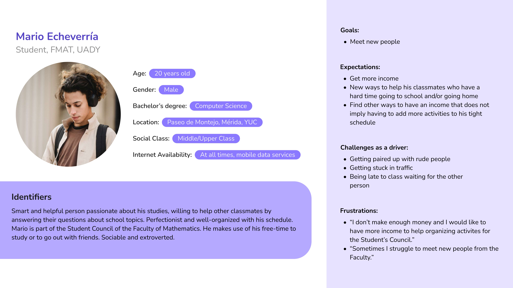
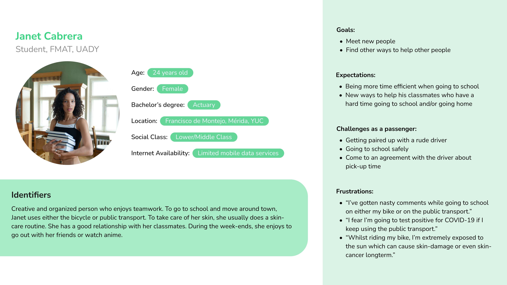

# :page_facing_up: First delivery

## Table of contents

- [Definition of the problem](#warning-definition-of-the-problem)
- [Project plan](#book-project-plan)
- [About our users](#grinning-about-our-users)
  - [Attributes](#attributes)
  - [Research methods](#research-methods)
    - [Surveys](#surveys)
    - [Experts interview](#experts-interview)
  - [Analysis of results](#analysis-of-results)
    - [General audience](#general-audience)
    - [Drivers](#drivers)
    - [Passengers](#passengers)
  - [Personas](#personas)
  - [Scenario](#scenario)
- [Contributions](#handshake-contributions)
- [Video presentation](#clapper-video-presentation)

## :warning: Definition of the problem

According to the Censo de Poblacion y Vivienda 2020 by INEGI, over 53 percent of students from 19 to 25 years need to move through public transportation.

In our student community, several use busses to reach the facilities. Some of them face problems like excessive payments for taking more than 2 different bus routes and time expending. Also, due to the COVID-19 pandemic, even if our university has implemented measures such as the use of mandatory face masks, there are situations that the university can´t cover, such as getting infected of COVID by using intensively public transportation.

The use of public transport for our colleagues can bring with it difficulties and be unsafe because it is a source of contagion, that’s why we present an initiative where university students share their vehicle with others near their habitual route to reach the facilities.

The users who will be able to participate will be exclusively students of the faculty. The students who own a vehicle could receive a commission for their help when putting it at the service of their classmates, and the students who use the service, would obtain a fast, safe, and efficient transport.

## :book: Project plan

Project tasks were managed using [Notion](https://jungle-baroness-076.notion.site/44cab109a5df4c80a86fbc4980e5b80f?v=1633fbb861ba4260a6c746beb3c6b015) as our workspace.

## :grinning: About our users

### Attributes

Following the [Persona Creation and Usage Toolkit](https://pdf4pro.com/view/persona-creation-and-usage-toolkit-interaction-by-design-4d669c.html) by George Olsen, we considered Usage goals/needs/attributes are required to recognize the problems and ambitions through the motivations, needs or frustrations that the user has about his current transport and the ride sharing proposal. We consider some Context-of-usage attributes to understand the larger context around the task. Finally, we added demographics to make Personas feel more like a real person.

- General
- Demographics
- Transport methods
- Thoughts about the proposal

### Research methods

#### Surveys

This is the main technique to collect user data because of time limitations, asking for both demographics, transportation needs and behavioral driver/passenger aspects. The implementation of the instrument exists as a [Google Forms survey](https://docs.google.com/forms/d/1bjP4idgR6uvtjDZnsr2I7SFVUlGwoIQo25Z87ZdgJ2U/edit#responses).

#### Experts interview

In addition to the transport situation of each student and their thoughts about the ride sharing initiative, we decided to interview the lawyer Elsy Chi, about the legal implications of carrying passengers, for building a higher level understanding needs of the proposal. The [interview](https://1drv.ms/w/s!Aid7glBVSnKngZpdwodBTs7c63_2sQ?e=wzw5PR) was realized in person and aims to collect qualitative data.

### Analysis of results

#### General audience

We obtained 34 responses and the surveyed covered students from Facultad de Matemáticas (FMAT).

From the data gathered, we concluded that 85.3% of the survey respondents, of which 79.4% were male, live in Merida scattered in various neighborhoods; we can observe that there is a higher frequency of students living in certain neighborhoods. They are also 18 years old or older and have a mobile device on hand; they are open to trying new technologies that will benefit their situation. They have an average of $217 pesos spent each week on public transport; something worth noting is that the quantities that presented a higher arithmetic mode were $500mxn and $60mxn.

Of the respondents, 52.9% are middle-upper class, followed by the 32.4% who belong to the middle-lower class.

68% of the respondents have internet while being transported to school, whilst 8% only during certain situations and the other 24% do not have internet connection available throughout their trip to school. On the other hand, 78.5% indicated that the most convenient method to go to school is to use their own vehicle.

According to the surveys, the main concern when taking the bus was the amount of time it takes to go to school, as well as possible delays due to traffic jam and the excess of passengers causing them not to be able to take the bus and have to wait for another one, which can take up to an hour or two. 70% of the respondents indicated that a shorter transfer time would have a substantial weight to change their method of transportation.

#### Drivers

We identified 19 students that can participate as drivers. 84.2% of them would be willing to transport other students to the faculty.

Those who would be willing to participate expressed their main motivation to do so; that would be the economic compensation focused on covering gasoline bills and the moral aspect of it, which is to help other students that struggle to get to the faculty and have negative consequences (from school “tardies” to high expenses due to public transport fees). On the other hand, the main concern that would make students second-guess themselves to participate to this proposal would be the fact that they don’t really know the passenger, so the drivers fear that they will behave inappropriately and that they will put the driver’s life or vehicle on danger. Others mention concerns such as transporting passengers that tested positive for COVID-19, having to deviate form their usual route or not getting the economic compensation.

With the purpose of being as safe as possible, the students consider that it is important to have both driver’s and passenger’s information. 78.9% of students consider that it is crucial to have enough information to identify their passengers as a way to ensure the safety during the trip, this percentage also are willing to share their personal data with them. Other recommendations mentioned by the respondents were to always use facemasks (due to COVID-19 safety reasons), an emergency button and the possibility for women to take rides with other women.

The frequency in which the respondents are willing to participate as drivers varies, some of them consider to participate from Monday to Friday, whilst others are willing to participate only three days of the week or depending on the days that they need to assist to the faculty for their classes.

33.3% of the drivers claimed to have car insurance that cover car accidents where the driver and passenger are involved. 38.9% claimed that they don’t have car insurance that cover the situation mentioned above and the remaining 27.8% don’t have car insurance at all.

According to the expert interview, it is very important that people who carry passengers have insurance that covers the high costs of compensation for injured or dead passengers that the law dictates.

#### Passengers

The users expressed their interest on participating in the proposed dynamic, however, through their answers we can identify that there needs to be a certain kind of trust; enough to make passengers feel comfortable to take rides from other people. Nevertheless, despite the concerns that could arise for this proposal, it is clear the reason why users would be interested on participating on this dynamic: time and comfortability. Nowadays, time is a very important factor, especially for university students. It is also mentioned the comfortability concept which, unfortunately, is hard to find in other transportation alternatives.

73.3% of survey respondents are willing to share their data with the driver, not everyone is willing to do so, but they changed their minds once they were asked if they would like to receive the drivers’ data as well, where 93.3% agreed.

From the students willing to be passengers, most of them think that, to feel as safe as possible, they recommend things like identification confirmation to assure that everyone who participates in this dynamic belongs to FMAT, as well as a psychological test and live tracking of the trip. Once their safety is ensured, 76.9% indicated that they would use this service every day, stating that their main motivation to be part of this dynamic is the time reduction dedicated to being transported to school. However, something that would prevent them from participating is the cost and if cases of harassment occur.

The advantage of using this service is an efficient and comfortable alternative of transportation.

### Personas

#### Driver

#### Passenger

### Scenario

#### Initial description:

Janet is an Actuary student who uses public transportation to get to FMAT, however, this transportation takes more time than she would like, and she is also worried about getting COVID due to the number of people on the bus. She would like a cheaper option than a taxi and one that is quick to go to her college.
On the other hand, there is Mario, a computer science student who goes to FMAT by car and who would be interested in earning extra money with some activity that does not consume much time.

#### Normal flow of events:

Mario shares the route he takes to get to the faculty with a possible passenger, then Janet realizes that Mario's route is very similar to hers. At first, she hesitates to contact him since she doesn't know Mario, but she decides to find out more about him and discovers that other students have taken a trip with him and they haven't had any complaints, so she contacts him to get to an agreement on the place and time so he can pick her up, as well as whether Janet is going to pay Mario or not for the trip depending on what they agreed on.

Mario picks up Janet as previously agreed, and they head to FMAT.

Finally, when they arrive to the destination, Janet pays Mario and each one goes their own way.

#### Considerations:

- Both the driver and the passenger could cancel the trip or not arrive at the agreed time. If this happens, it is required to notify the other user as soon as possible.
- The passenger may not want to pay the driver.
- Some aggression towards any of the users could occur.
- The payment method.
- Possible car accidents.

#### System status

Driver recommends other students to their driver and vice versa.

#### Notes

This was a first scenario that represents the basic interaction between the passenger and the driver. More research on user behavior is required to delve into the execution steps, as well as to discover other considerations and describe their scenarios.

## :handshake: Contributions

The following table contains the activities that were planned out during this first delivery as well as its value (basing it off of the amount of time it took to accomplish each activity) as well as the person who was in charge of the activity in question.

All activities will have a value from 1 to 3 depending on the amount of time it took to accomplish said activity, as previously mentioned.

| Activity          | Value | Participants          |
| :---------------- | :---: | :-------------------- |
| Create repository |   2   | Gener Echeverria      |
| Project planning  |   3   | William Cetina, Gener Echeverria, Jesús estrella, Valeria González|
| Persona Attributes (Slide) | 1 | William Cetina, Gener Echeverria, Jesús Estrella, Valeria González. |
| Elevator Speech | 2 | William Cetina, Gener Echeverria, Jesús Estrella, Valeria González |
| Surveys to FMAT Students | 1 | William Cetina, Jesús Estrella. |
| Interview with Expert | 1 | Gener Echeverria, Valeria González.  |
| Data Analysis from Surveys | 3 |William Cetina, Gener Echeverria, Jesús Estrella, Valeria González. |
| Create Personas | 2 |William Cetina, Gener Echeverria, Valeria González.|
| Create Scenarios | 2 |William Cetina, Jesús Estrella, Gener Echeverría.|
| Task tool control | 2 | Valeria González|
| Evaluation Document | 1 |Gener Echeverría, Jesús Estrella|
| First delivery presentation edition | 3 |William Cetina|
| First delivery presentation script | 2 |William Cetina,Gener Echeverria, Valeria González.|

This following table represents the contribution percentage of each member during this first
delivery.

| Member        | Points | Percentage         |
| :---------------- | :---: | :--------------------: |
| William Cetina |   19   | 28.35%      |
| Gener Echeverria |   19   | 28.35%      |
| Jesus Estrella |   13   | 19.42%      |
| Valeria González |   16   | 23.88%      |
| Total points |   67   | 100%      |

## :clapper: Video presentation

